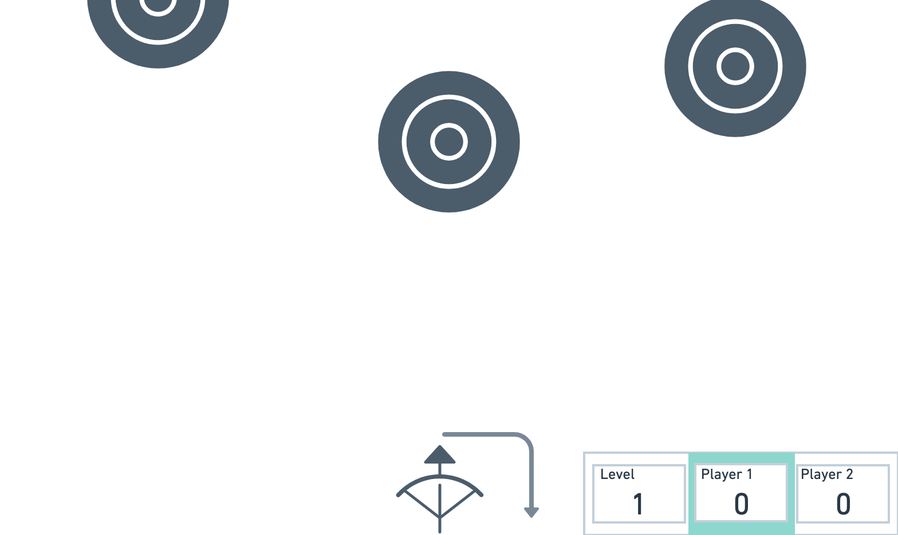

# Target Practice
##Overview
Target practice is a simple yet satisfying archery game. The browser-based challenge allows two plaerys to take turns as they try to hit moving targets that fall from the sky with their bow and arrow.

##Tech Stack

##Wire Frames

##MVP Goals

##Stretch Goals

##Potential RoadBlocks